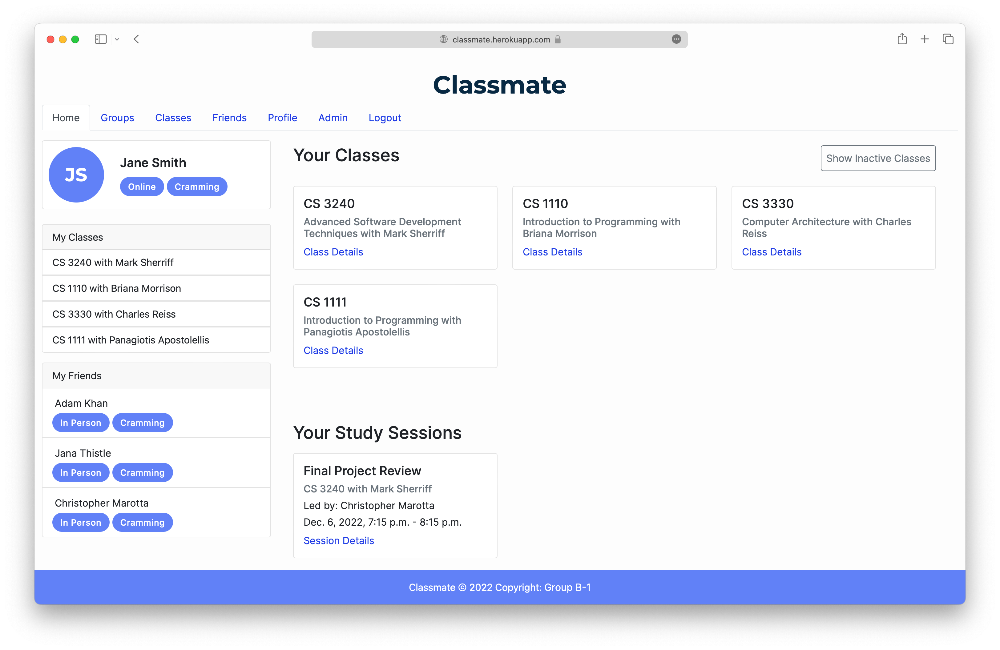
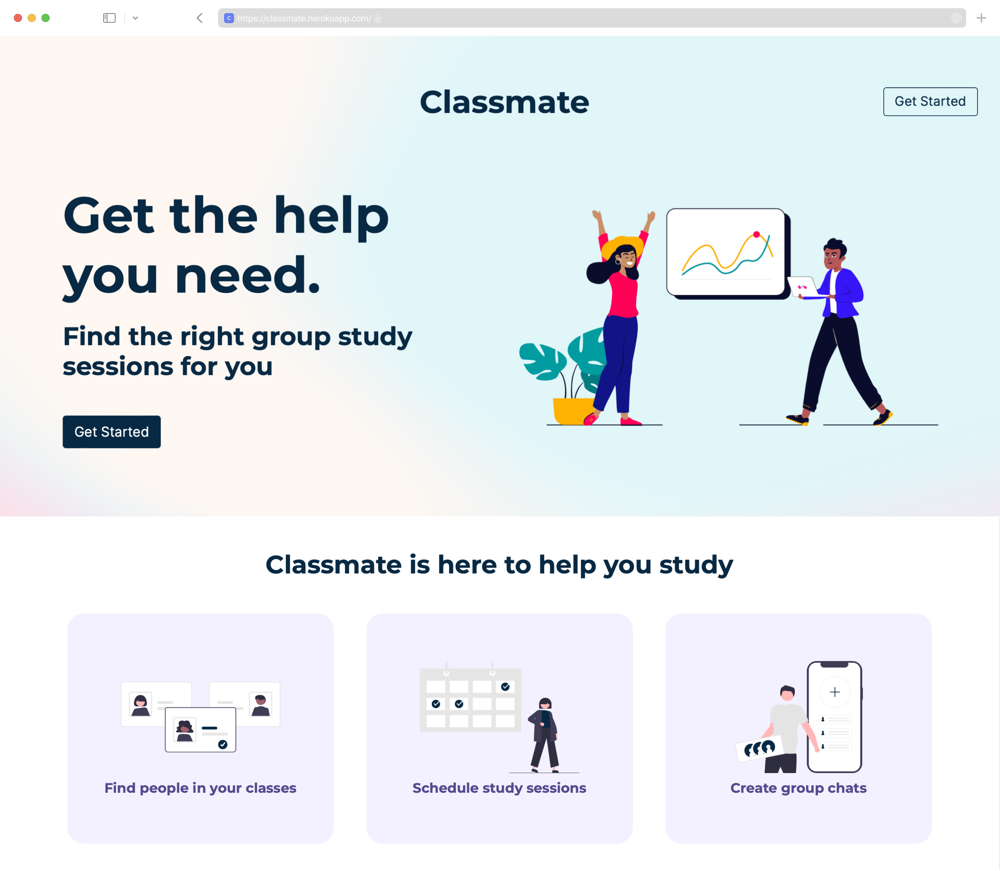
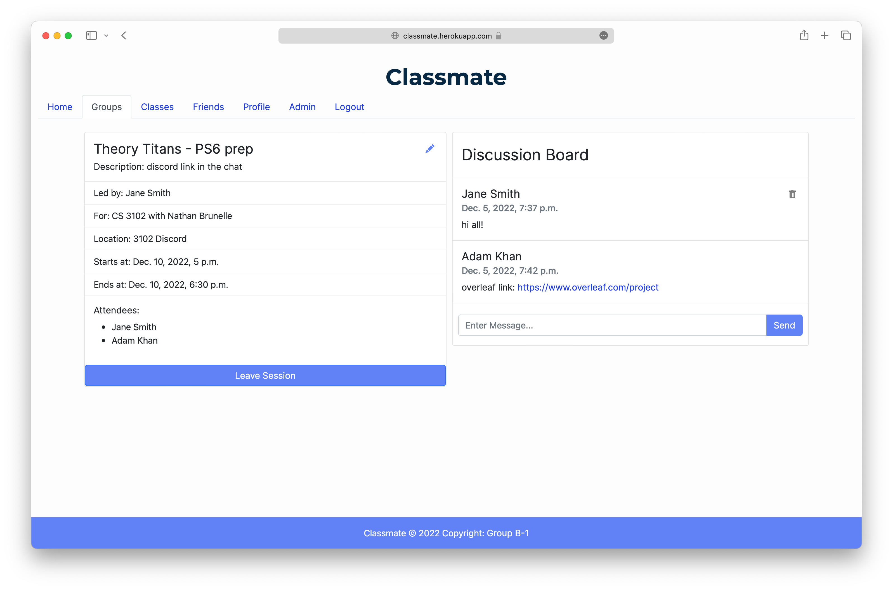

Group B-1: Classmate
==========================

[Classmate](https://classmate.herokuapp.com/) helps you find group study sessions for your classes.
------------------------------------------------------------

Classmate lets you add your classes to your profile quickly so you can get right to finding your study partners. Quiz coming up? Last minute cram? We got you covered, join now!  
**Main site: https://classmate.herokuapp.com/**  
> My contribution to this group project included:
> * Designed and Prototyped UI in Figma
> * Developed Django HTML templates, implementing Bootstrap and custom CSS.
> * Maintained models and linked data to front end.

### Classmate is built using these tools and technologies

Classmate is made by Jerry, Adam, Chris, Jessica, and Eloise (Group B-1) for CS 3240 at UVA.  
Classmate is a full stack web application that incorporates the Django Web Framework, Python, PostgreSQL, HTML, Bootstrap, CSS, and JavaScript.

APIs used:  
[Luther's List API](http://luthers-list.herokuapp.com/api/)  
[Algolia Search API](https://www.algolia.com/)  
[Google Fonts API](https://developers.google.com/fonts)  

App Preview:  
|   Main Dashboard |   Classes Page (with Algolia Search API) |
|:--:|:--:|
|  **Landing Page** |  **Study Session and Discussion Board** |

Sources:  
[Undraw](https://undraw.co/illustrations) and [Blush](https://blush.design/) for illustrations  
[ProfileMe](https://www.profileme.dev/create-profile) for this readme template  
[Meshgradient](https://meshgradient.com/) for the gradients in the background  
[Django Jazzmin](https://django-jazzmin.readthedocs.io/) for the admin panel theme
